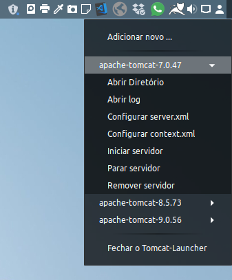

# Tomcat-Launcher

## Description

Tomcat-Launcher was developed entirely in [Electron](https://www.electronjs.org/) in order to facilitate the execution, administration in multiple instances of Tomcat, as well as, to facilitate the deployment and testing of packages *.war.

## Contributors

[Luciano Brito](https://github.com/lucianobritodev)

Brazilian, married, born in 1991, passionate about technology. Graduated in Systems Analysis and Development from Paulist University (UNIP) in 2019. 

## Contacts

- [LinkeIn](https://www.linkedin.com/in/luciano-brito-dev)
- [Gmail](mailto:lucianobrito.dev@gmail.com)
- [Instagram](https://www.instagram.com/lucianobrito.dev)

## Donates

