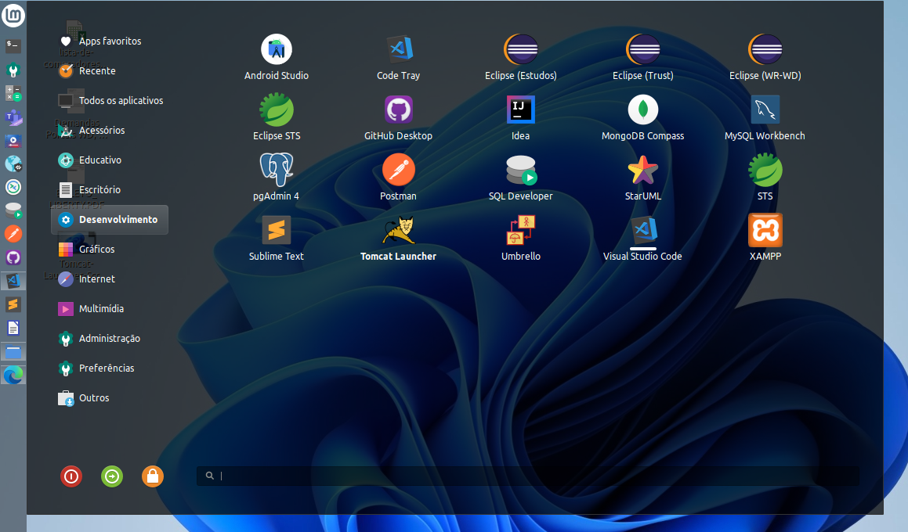
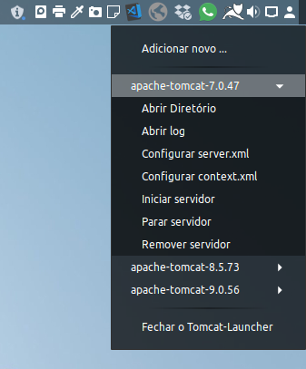

# Tomcat-Launcher




## Description

Tomcat-Launcher was developed entirely in [Electron](https://www.electronjs.org/) in order to facilitate the execution, administration in multiple instances of Tomcat, as well as, to facilitate the deployment and testing of packages *.war.

## Installation

Open the `dist/installers` folder and download and install the tomcat-launcher*.deb.

## Compiling the Project Locally

1. To compile the application, first of all, clone the project or download the zipped source code to your local machine.
2. Access the project folder and run the command to download the dependencies:
```
$ npm install
```
3. run the command to build the application.
```
$ npm run build
```
4. Access the `dist/installers/` in project and install the generated tomcat-launcher*.deb package.

With that the application will be working. Right now you can add the versions of Tomcat server that are on your machine local.


## Contributors

[Luciano Brito](https://github.com/lucianobritodev)

Brazilian, married, born in 1991, passionate about technology. Graduated in Systems Analysis and Development from Paulist University (UNIP) in 2019. 


## Contacts

- [LinkeIn](https://www.linkedin.com/in/luciano-brito-dev)
- [Gmail](mailto:lucianobrito.dev@gmail.com)
- [Instagram](https://www.instagram.com/lucianobrito.dev)


## Donates

[](https://www.paypal.com/donate/?hosted_button_id=SX3L4N89M8ZRW)